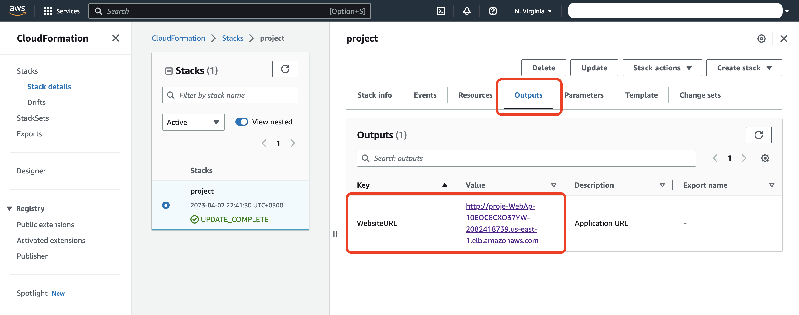

# Deploying Infrastructure as Code (IaC) 

With the advent of cloud computing, along came several tools that enabled us to deploy the underlying infrastructure components that provide security and services to our servers by writing scripts. In this project, I wrote this infrastructure using CloudFormation, AWS' tool for Infrastructure as Code. 
Infrastructure patterns that are used in the industry broadly and can be readily used to deploy any cloud application. 

I started by drawing Cloud Architecture Diagram. Then I deployed this architecture using CloudFormation.


The Diagram mentioned above has been translated to Infrastructure as a Code (IaaC) using AWS CloudFormation Service. 

### Project Files:
1. CloudFormation Script Template File `iac.yml`.
2. Parameters File `iac-parameters.json`.

### How to run this IaC Solution

1. CloudFormation stack **creation** can be done using the following command:


```
./create infra iac.yml iac-parameters.json 
```


**./create** is a Bash Script file which contains the actual CloudFormation stack creation command. where is the first parameter is the `Stack Name`, the second parameter is the `Template Body` file and the third parameter is the `Parameters` file.


2. CloudFormation stack **update** can be done using the following commands:


```
./update infra iac.yml iac-parameters.json
```


**./update** is a Bash Script file which contains the actual CloudFormation stack update command. where is the first parameter is the `Stack Name`, the second parameter is the `Template Body` file and the third parameter is the `Parameters` file.

### Some Screen Shoots After Stack Created:

1. Healthy Instances


2. Website URL in Output Section


